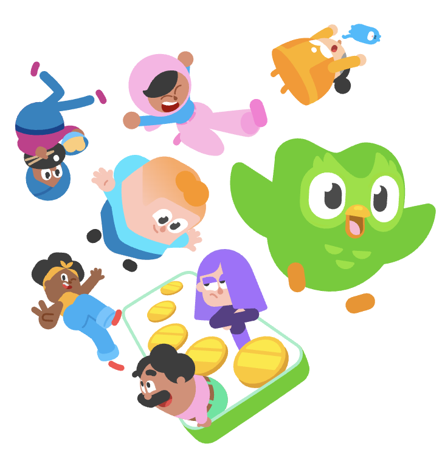

# hi! i'm Eryn

### these are my projects:
| for now, i'm learning html/css for my communications class
- [goldie](goldie)
- [how not to sleep](tutorial)
- [duolingo parody](duolingo-home)

#### goldie
my first project **goldie** was about my cat...goldie

#### how not to sleep
second was about some sillyscenarios that could happen when trying to sleep, while providing some advice

#### duolingo parody
usually, duolingo takes a long time teaching the user languages, which is why i decided to make a parody of it.

### ...more to come

## thank you for exploring my page

