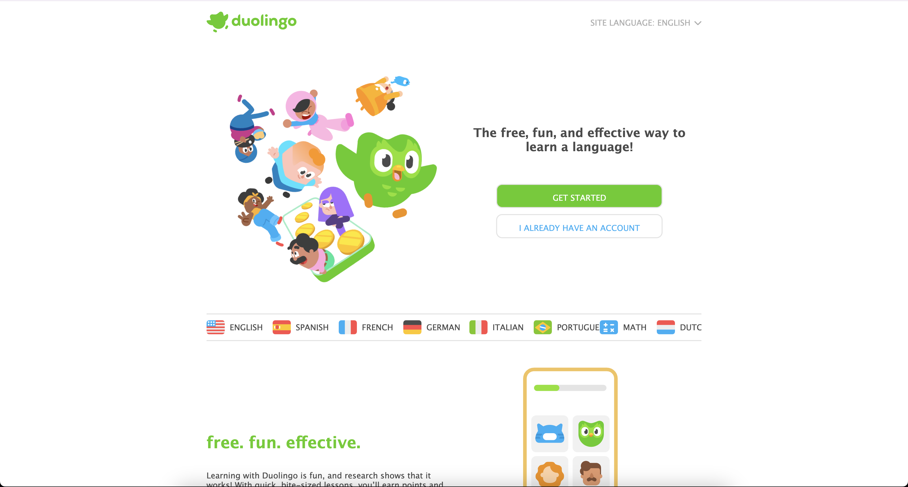
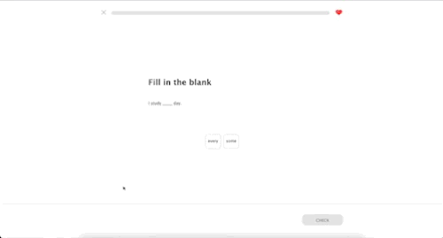
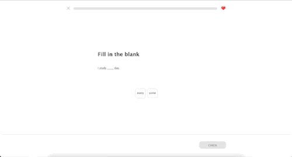

# DuoLinger
### A parody language-learning interface

**By Eryn**

---

## Project Description
DuoLinger is an interactive website inspired by the experience of using Duolingo. 

The project recreates familiar parts of the app—lessons, streak goals, matching exercises, and feedback—but exaggerates them slightly to reflect two common experiences: 
- The constant reminders and words of encouragement;

- The slow pace of progress that can come from learning through short daily lessons.

---

## Abstract
Language learning apps often say that small daily lessons will lead to long-term progress. Interfaces are designed to encourage consistency through streaks, achievements, and constant reminders to return.

DuoLinger recreates this environment but introduces subtle differences in tone and interaction. The interface sometimes feels more aware of the user’s actions, while lesson feedback and streak goals emphasize how much time learning can require. 

The project shows both motivation and pressure in digital learning tools, as well as the difference that can be seen between daily practice and real language fluency. 

By using familiar interactions like hovering, clicking, matching words, and completing lessons, the user experiences a slightly altered version of a language learning app that draws attention to these dynamics.

---

## Features
- Interactive lesson exercises  
- Word matching activity  
- Fill-in-the-blank sentence exercise  
- Hover interactions that reveal additional messages  
- Streak goal selection interface  
- Alternative feedback screen when the user answers incorrectly    

---

## Images

### Homepage


*A landing screen inspired by the Duolingo onboarding interface.*

---

### Lesson Interaction


*Matching and sentence-building exercises similar to common language learning activities.*

---

### Feedback Screen


*An alternative feedback page where Duo becomes more watchful when the user makes a mistake.*

---

## Technical Notes
The project was built using **HTML and CSS**. 

One technical challenge was keeping the footer at the bottom of the page while the main content stayed centered on the screen. 

Normally, centering content vertically can cause the footer to move upward when there is not much content on the page. To solve this, I structured the main container using Flexbox so that the content stays centered within a minimum height, while the footer remains positioned at the bottom.

The `#main` container uses a column layout with centered alignment and a minimum viewport height so the content fills most of the screen. The footer is styled separately with a top border and layout controls so it stays visually anchored at the bottom.

```css
#main {
    display: flex;
    flex-direction: column;
    justify-content: center;
    align-items: center;
    min-height: 78.5vh;
    width: 100%;
}

#footer {
    border-top: 2px solid rgb(229, 229, 229);
    position: sticky;
    display: flex;
    flex-direction: row-reverse;
    padding-top: 40px;
} 
```
---

## Try the Project
Open the project in a browser and move through the lesson flow by **clicking, hovering, and selecting answers**.
**[duolinger](https://erynbkt.github.io/CommLab/duolingo/)**
