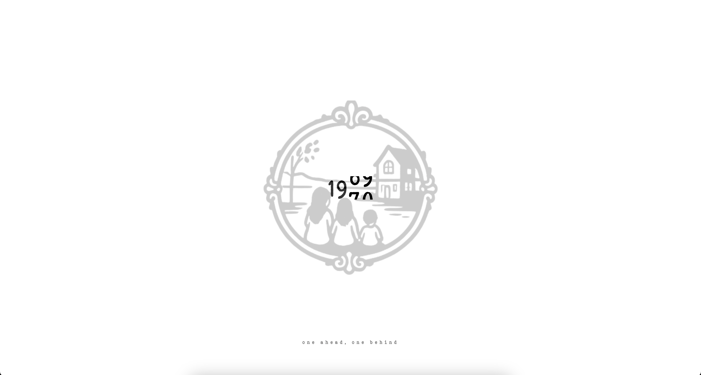
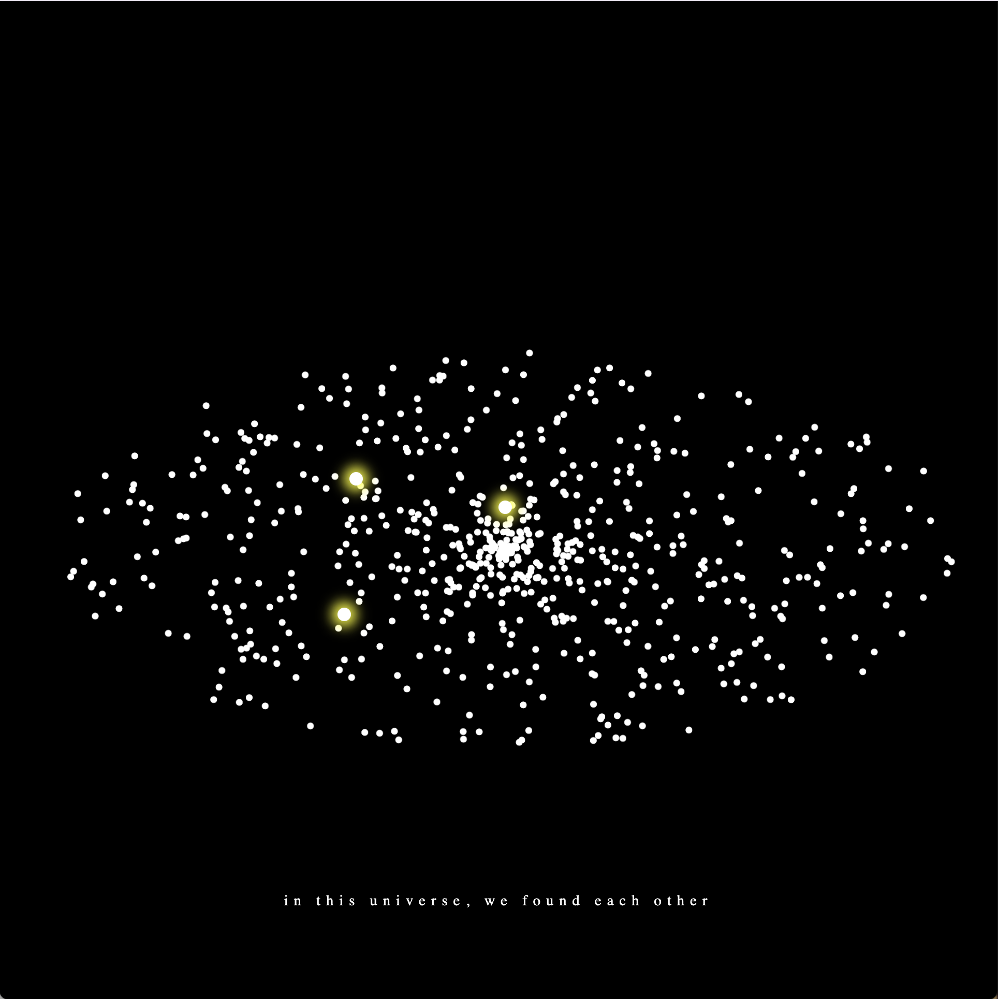
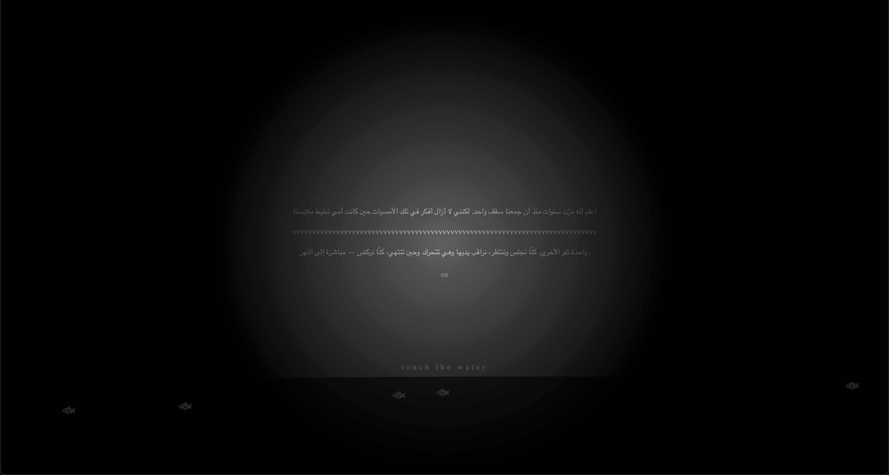

# One by One
### A web experience about sisterhood

**By [Your Name]**

---

## Project Description
One by One is an interactive website inspired by a story my mother told me about growing up with her two sisters in the 1960s.

The project moves through four pages, each one using a different interaction to tell a part of the story:
- A year counter that rolls from 1965 to 1970 as the user scrolls, with a short line from my mother appearing with each year
- A mirror showing the three sisters outside their home, where the user has to find the galaxy hidden in the sky
- A galaxy made of hundreds of dots, three of which are special and need to be found
- A letter written in Arabic and English, only visible where the cursor moves

---

## Abstract
"One by One" is a story about sisterhood, told through the eyes of my mom, who grew up as the middle of three sisters in the 1960s. It traces the years of their childhood, the small traditions they shared, and the universe they built together. The experience is shown through scrolling, sound, and discovering.

The website begins with a year counter that changes from 1965 to 1970. From there, the user explores a mirror showing the sisters outside their home, then enters a galaxy where three glowing stars need to be found. The final page shows a letter written in Arabic and English, with a stitching animation that interrupts the text at the moment their mother was sewing their clothes, and a river at the bottom, leading to the final page.

---

## Features
- A scroll-driven year counter that slides each digit upward one by one
- A mirror interaction where moving the mouse also moves the scene inside the mirror. The user has to find the galaxy hidden in the sky to move forward
- A galaxy of hundreds of dots where three special ones glow differently and need to be found by hovering. Once all three are found, the other dots fade away
- A typewriter letter written in Arabic that pauses mid-sentence for a stitching animation, then continues. The user can toggle to English once the letter finishes typing
- A cursor light effect on the final page where the text is only visible where the mouse moves, like holding a candle over old paper

---

## Images

### The Year Counter


*The year rolls forward as the user scrolls. A short line from my mother appears with each digit.*

---

### The Galaxy


*Hundreds of dots fill the screen. Three of them glow differently.*

---

### The Letter


*The letter is only visible where the cursor moves, implying that the user becomes the light.*

---

## Technical Notes
The most challenging part was the galaxy interaction on page 3. The page is made of hundreds of dots, three of which are special. But at first, users couldn't find them at all. After feedback during the interaction day, I made the special dots glow yellow to hint that something was different about them.

```javascript
function specialDotWasHovered(eventInfo) {
    let dot = eventInfo.target

    if (dot.style.backgroundColor != "black") {
        dot.style.transition      = "all .3s linear"
        dot.style.transform       = "scale(2)"
        dot.style.backgroundColor = "#ffff008a"
        dot.style.borderRadius    = "50%"

        specialDotsFound = specialDotsFound + 1

        if (specialDotsFound >= 3) {
            removeOtherDots()
        }
    }
}
```

---

## Try the Project
Try the project by **scrolling, moving your mouse, hovering, and clicking**.

**[one by one](https://erynbkt.github.io/CommLab/project-2/)**